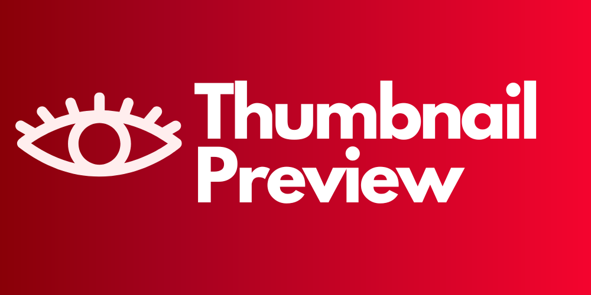

# 🌟 Thumbnail Preview - See Yourself Shine! 🌟

---

## 🎬 Elevator Pitch

Ever wondered how your YouTube video thumbnail, title, and description would look like in the YouTube search results? Want to make sure your thumbnail pops and stands out from the crowd? Say hello to **Thumbnail Preview**, the Chrome extension that lets you preview and compare your YouTube video's thumbnail, title, and description right in the search results. It's like having a mirror in the YouTube universe!

---

## 🎥 Features

- **Real-Time Preview**: See how your thumbnail, title, and description look in real-time.
- **Compare & Contrast**: Easily compare your video with others in the search results.
- **Easy to Use**: Just upload your thumbnail and enter your title and description. Voila!
- **Local Storage**: Saves your last preview so you can come back and tweak anytime.
- **Absolutely Free**: No hidden charges, no in-app purchases. Free like the best things in life!

---

## 🛠️ Installation

1. **Download the Extension**: Click [here](#) to download the extension from the Chrome Web Store. (coming soon)
2. **Add to Chrome**: Click on "Add to Chrome" and then "Add Extension" in the popup.
3. **Pin to Toolbar**: After installation, make sure to pin the extension to your toolbar for easy access.

---

## 🎮 How to Use

1. **Click the Icon**: Click on the Thumbnail Previewer icon in your Chrome toolbar.
2. **Fill the Form**: Upload your thumbnail and fill in your title and description.
3. **Submit**: Click the "Submit" button.
4. **Go to YouTube**: Search for something on YouTube and see your video previewed in the search results.
5. **Compare**: Scroll through the list and see how your video stacks up against the competition.

---

## 📝 FAQs

**Q: Is this extension free?**  
A: Absolutely, it's free and always will be.

**Q: Will this affect my actual YouTube video?**  
A: No, this is just a preview. Your actual YouTube video remains unchanged.

**Q: Can I preview multiple videos?**  
A: Currently, you can preview one video at a time. But stay tuned for updates!

---

## 📞 Support

Found a bug 🐞? Have a feature request 🌈? Or just want to say hi 👋?  
Post in the Issues or make a Pull Request

---

## 🌐 Social Media

Follow me for updates and more:

- [Twitter](https://twitter.com/rjburkejr)
- [LinkedIn](https://www.linkedin.com/in/roland-b-76a94a160/)

---

## 📜 License

This project is licensed under the GNU Affero General Public License v3.0 - see the [LICENSE.md](LICENSE.md) file for details.

---

## 🎉 Final Words

Ready to make your YouTube thumbnails the star of the show? Install **Thumbnail Previewer** now and let your creativity shine! 🌟

---

**Made with ❤️**

---
